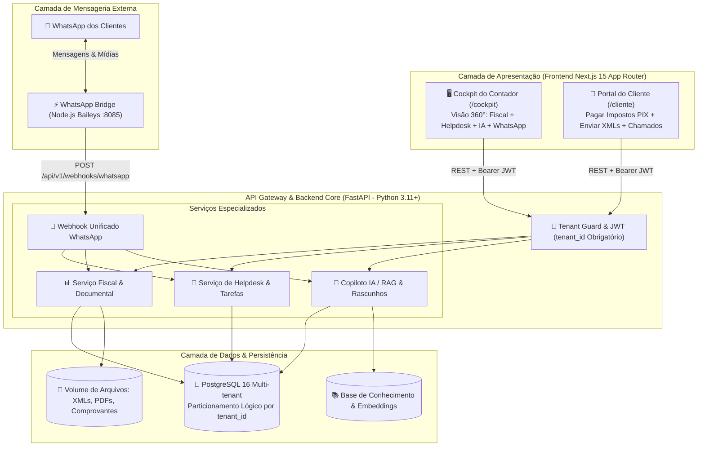

# 🏛️ FUSION_ARCHITECTURE.md
## Arquitetura Unificada da Plataforma ContabFlow All-in-One
### Plataforma Integrada de Gestão Fiscal, Automação WhatsApp e Helpdesk com IA Assistida

---

### 1. Visão Geral da Arquitetura de Microsserviços

O **ContabFlow All-in-One** consolida dois domínios contábeis essenciais em um ecossistema desacoplado, escalável e de alta performance:
1. **Domínio Fiscal & Tributário:** Emissão de guias (DAS, DARF, FGTS, ICMS) com PIX e código de barras, auditoria de notas fiscais (XML NF-e/NFC-e), extratos bancários e régua de cobrança automática.
2. **Domínio de Atendimento & Helpdesk com IA:** Caixa de entrada unificada para dúvidas e pedidos de serviços, triagem por departamento (*fiscal, contábil, folha, societário*), controle de SLA, tarefas internas da equipe e Copiloto de IA fundamentado em Base de Conhecimento (RAG) com revisão humana obrigatória.

---

### 2. Responsabilidades dos Componentes

#### 2.1. Backend FastAPI (Python 3.11+)
* **Coração de Dados e Regras de Negócio:** Centraliza a persistência relacional com SQLAlchemy ORM e validação estrita via Pydantic v2.
* **Isolamento Multi-Tenant:** Implementa o `Tenant Guard` em nível de injeção de dependência (`deps.py`), garantindo que nenhuma requisição acesse dados fora do seu `tenant_id`.
* **Motor de IA & RAG:** Integração nativa com provedores de LLM (OpenAI / Gemini) e indexação da base de conhecimento para gerar rascunhos de resposta com precisão técnica.
* **Orquestração do Webhook WhatsApp:** Processa eventos de mensagens recebidas, identificando o cliente e despachando automaticamente para o módulo fiscal (se for mídia/guia) ou para o Helpdesk (se for dúvida textual).

#### 2.2. WhatsApp Bridge (Node.js Baileys :8085)
* Conexão socket resiliente ao WhatsApp via biblioteca Baileys.
* Geração e renovação dinâmica de QR Code visual para pareamento pelo contador.
* Recebimento de mensagens, fotos, áudios e PDFs com encaminhamento imediato via webhook autenticado para o backend FastAPI.
* Envio de mensagens ativas e templates de cobrança com chave PIX e linha digitável.

#### 2.3. Frontend Unificado (Next.js 15 App Router)
* **Cockpit do Contador (`/cockpit`):** Painel 360° unificado reunindo métricas fiscais, chamados do helpdesk com alerta de SLA, fila de rascunhos de IA aguardando aprovação humana e console de conversas do WhatsApp.
* **Portal do Cliente (`/cliente`):** Interface intuitiva e responsiva (mobile-first) para o empresário visualizar impostos do mês com PIX copia e cola, fazer upload de documentos e abrir chamados de suporte.

---

### 3. Comunicação Inter-serviços & Contratos

* **Frontend ◄► Backend:** RESTful APIs em JSON sobre HTTPS com autenticação `Bearer <JWT>`.
* **WhatsApp Bridge ◄► Backend:** Webhooks HTTP assíncronos protegidos por header `apikey` validado contra `WHATSAPP_WEBHOOK_SECRET`.
* **Backend ◄► PostgreSQL:** Pool de conexões otimizado com SQLAlchemy, operando transações isoladas por tenant.
